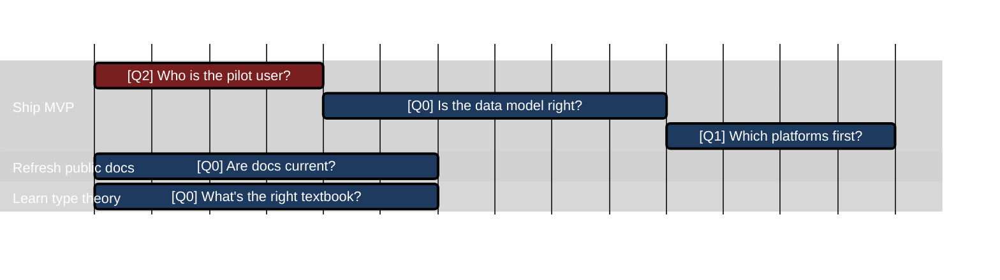

## Reference

### Ship MVP

| ID | Question | Priority | Days | Status | Action points |
|----|----------|----------|------|--------|---------------|
| Q2 | Who is the pilot user? | Critical | 2 | open | [ ] Outreach to candidates (2d, managing) |
| Q0 | Is the data model right? | High | 3 | open | [ ] Design schema (2d, analysis) [ ] Write migration (1d, programming) |
| Q1 | Which platforms first? | Medium | 2 | open | [ ] Compare desktop vs web (1.5d, research) [ ] Decision doc (0.5d, writing) |

### Refresh public docs

| ID | Question | Priority | Days | Status | Action points |
|----|----------|----------|------|--------|---------------|
| Q0 | Are docs current? | Low | 3 | open | [x] Audit landing page (1d, qa) [ ] Rewrite quickstart (2d, writing) |

### Learn type theory

| ID | Question | Priority | Days | Status | Action points |
|----|----------|----------|------|--------|---------------|
| Q0 | What's the right textbook? | LongTerm | 3 | open | [ ] Read TaPL ch.1 (3d, research) |
